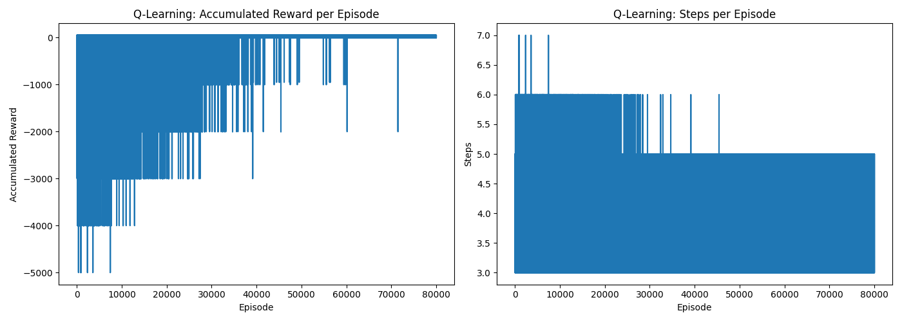

# Tic-Tac-Toe

## Base game

The base game found in the `base` directory is a simple implementation of the game Tic-Tac-Toe. It is a two player game where the players take turns to place their mark on the board. The first player to get three of their marks in a row wins the game.

## Q-Learning

The Q-Learning implementation found in the `q-learning` directory implements a reinforcement learning algorithm that learns to play Tic-Tac-Toe. The algorithm learns by playing games against a dumb agent (that randomly picks any available empty position) and updating its Q-table based on the rewards of the actions. 

### Training results

The agent was trained for 80,000 episodes. The results below show that the agent learns the actions that minimise the loss of reward over the episodes and minimises the steps needed to win or end the game:

### Playing against the agent

You can play against this trained agent by running the `q-learning/main.py` script. The agent will always be player 0 and you'll be player 1. Current implementation makes the agent focus on winning rather than blocking the opponent from winning, so it is possible to beat the agent easily.

### Dependencies

The only dependency needed is `numpy`.

